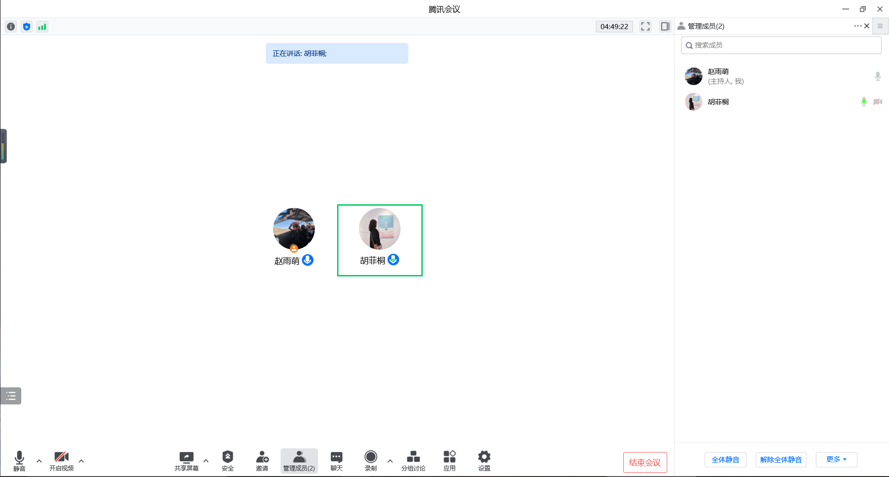

# 320 垃圾回收站

本项目是中国传媒大学信息安全综合实践课程的作业，旨在模拟类似畅课的学生作业上传及下载的 Web 平台

## 功能清单

- 基于网页的用户注册和登录登出系统
  - 允许用户注册到系统，即 become a rubbisher
    - 各字段均不能为空，含相关校验及错误提示
    - 同一邮箱不能重复注册
    - 对用户密码进行强度校验，密码需包含 8 个以上的字符且其中必需含有 1 个字母和 1 个数字
    - 密码输入不可见，且包含密码匹配字段，确保用户密码输入无误

  - 使用合法用户名和用户密码登录系统，即 Log in
  - FixIt 后，禁止使用明文存储用户密码且登录采用用户邮箱及用户密码
    - 存储的口令即使被公开，也无法还原/解码出原始明文口令
    - 登录部分会对邮箱格式进行校验，避免使用 SQL 万能口令登录系统的可能
- 基于网页的文件上传与文件下载
  - 允许用户上传文件，即丢垃圾
  - FixIt 后，文件存储位置从文件夹变为数据库，允许用户浏览已上传的文件的信息并进行下载，即查看所有已丢垃圾以及捡垃圾
- 网页流程图
  - 

## 本项目用到的关键技术

- 前端使用的 js 和 css 框架已下载并置于 `/src/www/static` 中
- 后端使用 PHP 编写
- EXP 和 CHECKER 脚本均采用 Python 编写
- 程序部署运行环境采用 docker

## 快速上手体验

- 安装 Docker 
- 分别进入 BuildIt&BreakIt 和 FixIt 文件夹下的 `源码/docker`，开启 git bash ，输入命令 `docker compose up`，打开浏览器访问： http://localhost 即可开始体验

## GitHub 源码展示

- [查看源码以及实验报告](https://github.com/xie-yi-nong/2022Summer-Comprehensive-Practice-of-Information-Security)

## 演示

- [查看演示视频](https://m.weibo.cn/7644232314/4800689966154528)

## 附录-1：人员分工

- 前后端开发：胡菲桐、赵雨萌
- 漏洞注入：谢意浓、黄清晓、冉婷
- EXP 脚本撰写：谢意浓
- CHECKER 脚本撰写：黄清晓
- Docker 封装：李子钰

## 附录-2：会议记录

- 2022-07-09
  - 
- 2022-07-13
  - 
- 2022-07-18
  - 
- 2022-07-21
  - 
- 2022-08-09
  - 

