胡菲桐
# 「320垃圾回收站」总结技术报告
## 主要负责内容：网页前后端开发部分实践（此部分由两人共同完成）
## 实践目的及内容
- 本次项目设计的是一个可实现注册、登录、退出登录、文件上传、文件下载等功能，并通过 MySQL 数据库保存用户信息及上传文件信息的具有实用性功能的仿真网站
- 通过 php 文件和 html 文件实现网页的设计制作和数据库与网页的连接，通过 phpMyAdmin 实现数据库的管理和建立
## 实验环境
- PHP
- phpMyAdmin
- XAMPP
- Apache
- MySQL
## 实验步骤
### VSCode 配置 php 开发环境
- 安装 xampp ,作为可以开启 Apache 和 MySQL 端口连接数据库的软件，仅需要下载并启动安装程序
- 在 D 盘新建文件夹 xampp ，将软件安装到此处，根据需求开启服务
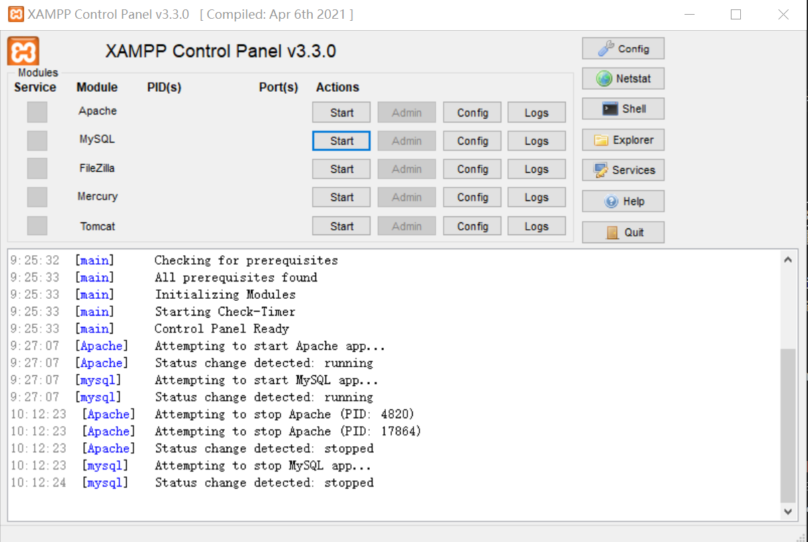
- 添加系统变量，把 php.exe 文件所在路径 ("D:\xampp\php") 添加到环境变量-系统变量- Path 中，添加完成后，在 cmd 中输入 `php -v` 检查是否配置成功
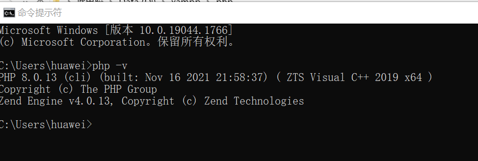
- 在 VSCode 中下载 php 相关插件，如 PHP Debug 、PHP Intelephense 等
- 点击 VSCode 的文件-首选项-设置，在设置的扩展中找到 PHP ，点击setting.json添加以下配置
```
    "php.validate.executablePath": "D:/sdk/php/php/php.exe",
    "php.debug.executablePath": "D:/sdk/php/php/php.exe"
```
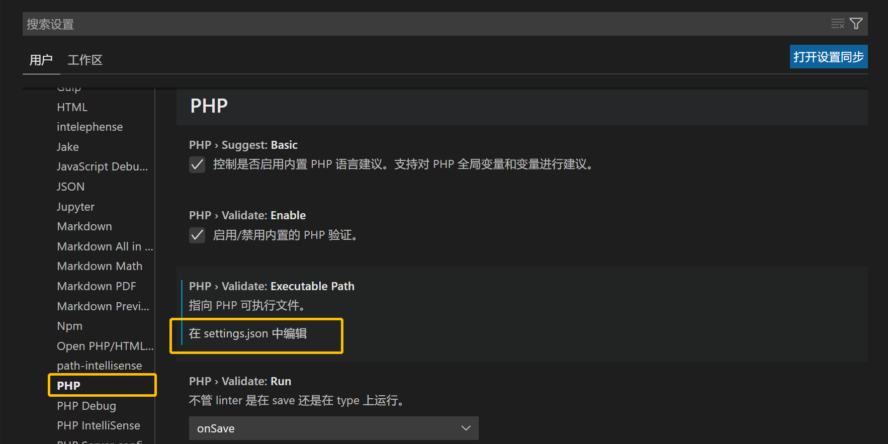
- 可以简单写一个 php 文件，进行调试，在浏览器中打开要调试的 php 文件可以输入服务器地址(localhost:3000/xxx.php)
- 也可以下载 PHP Server 插件，直接跳转到浏览器（比较方便）
### phpMyAdmin 安装
- 下载 phpMyAdmin 并解压至 xampp 文件夹中
- 复制解压后文件夹中的 `config.sample.inc.php` 文件并改名为 `config.inc` ,并作如下修改
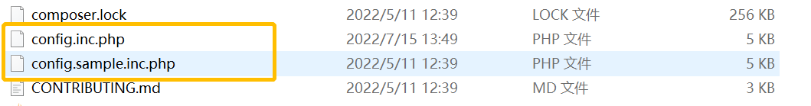
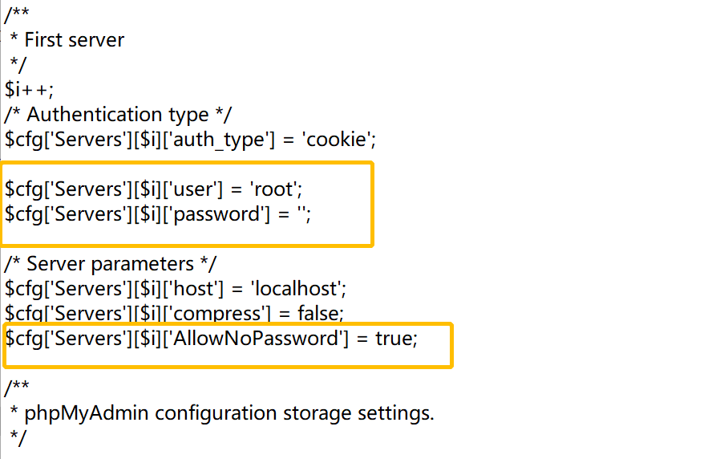
- 注：因为 xampp 安装时，MySQL 默认的账户是 root ,密码是空，后期可自行修改密码
- 开启 xampp 的 Apache 和 MySQL 服务，即可在浏览器开启 phpMyAdimin (http://localhost/phpmyadmin/)
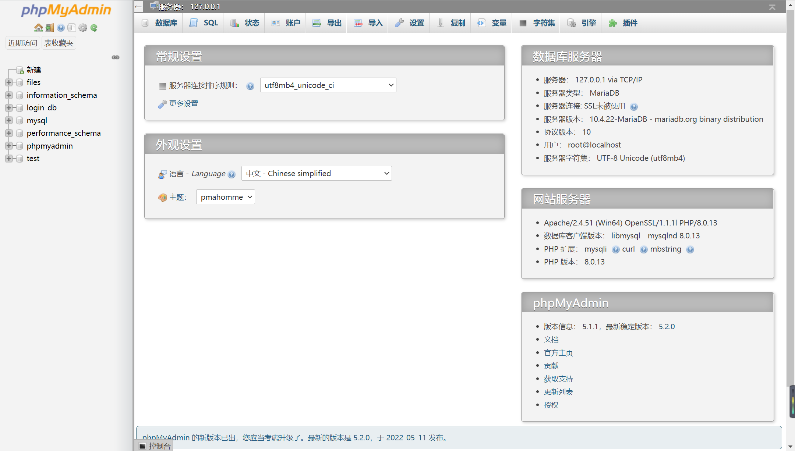
### 编写网页，创建数据库并连接
1. 注册页面（signup.html）
   - 各属性值字段均不为空（含有错误提示）
   - 用户账号与 email 字段一一对应，避免同一邮箱重复注册
   - 密码输入不可见，且包含确认密码字段，保证用户第二次没有错误输入，且包含相应的提示语句
   - 添加 JavaScript 代码和无类的 CSS 框架（将源码下载到本地，避免联网操作）
   - login_db 数据库和注册页面连接，存储用户信息
   - process.php 存储注册时需要的错误操作提示信息
2. 登录页面（login.php）
   - 用户执行登录操作时，会和 login_db 数据库中 user 表已包含的用户信息进行比对
   - 若 Email 字段或密码 Hash 值与数据库中已有数据不匹配时，页面会返回 invalid login 字段，表示无效登录
3. 文件上传页面（index.php）
   - 页面顶部可显示正在登录的用户
   - 可以进行选择文件以及文件的上传操作（丢垃圾）
   - files 数据库和文件上传页面连接，存储上传的文件信息
   - index.php 文件中包含判断语句，若用户选择了 logout 操作，则返回到选择注册登录页面
   - 相对于修改前的文件上传页面不易嵌入漏洞
4. 查看所有上传文件和下载文件页面（list_files.php）
   - 罗列所有已上传的文件信息（文件名、格式、文件大小、上传时间）
   - 每行最后可以对已上传文件进行下载，默认保存到此电脑-下载文件夹处
5. 退出登录页面
   - 登录后的每个页面均含有 logout 按钮点击后会退出登录
   - 退出登录后可选择注册或登录
6. 可进行文件上传漏洞实验的页面/修改前的文件上传页面（upload.php）
   - 文件上传到`/uploadFiles/`文件夹中，可以进行文件上传漏洞的注入操作
   - 丢垃圾(上传)成功后会显示已上传文件存放的路径，便于进行漏洞实验
7. 可进行 sql 注入登录页面
   - 此登录页面使用姓名登录、密码取消了哈希值的计算，便于进行sql注入
### 图片展示
- 网页流程图

- 数据库属性图
  - 用户数据库（login_db）
  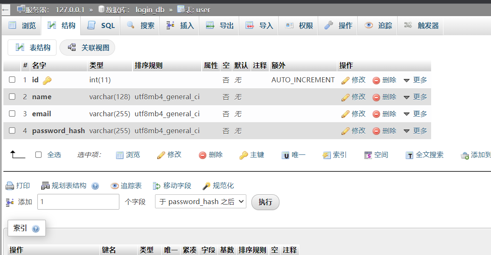
  - 注册过的用户可在数据库中查看
  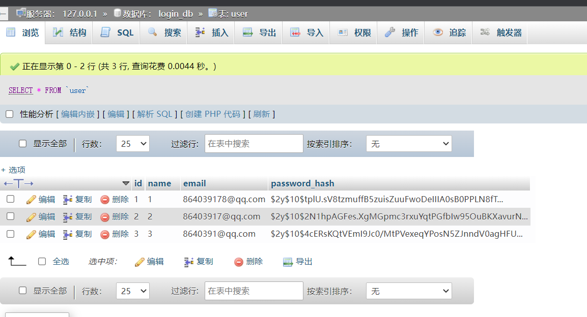
  - 文件数据库(files)
  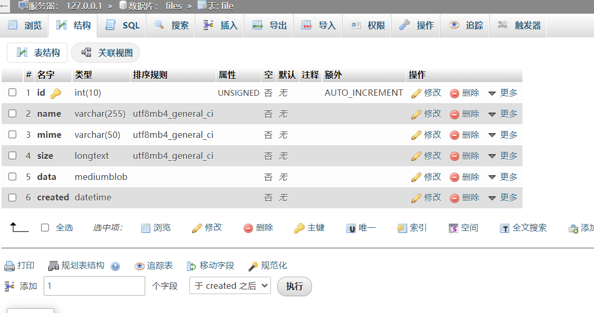
  - 上传的文件可在数据库中查看
  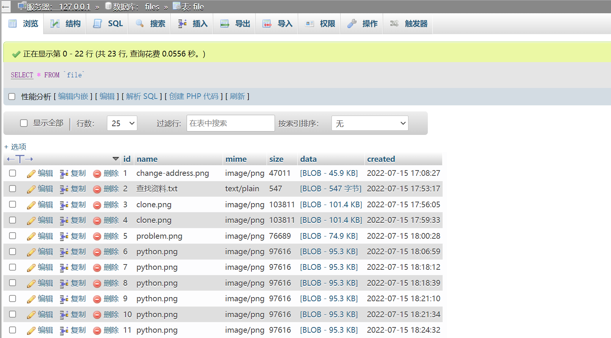
- 页面效果展示
  - 注册页面
  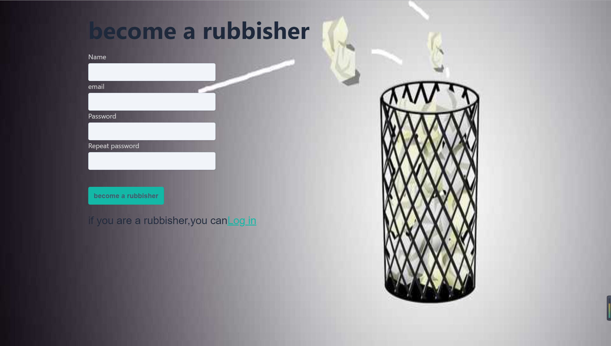
  - 注册提示错误(要求 Name、email 等字段不为空，且 email 不能是格式错误的邮箱和已注册过的邮箱、密码必须包含至少 8 字符，字母和数字都至少一个,密码重复确认时必须匹配等问题)
  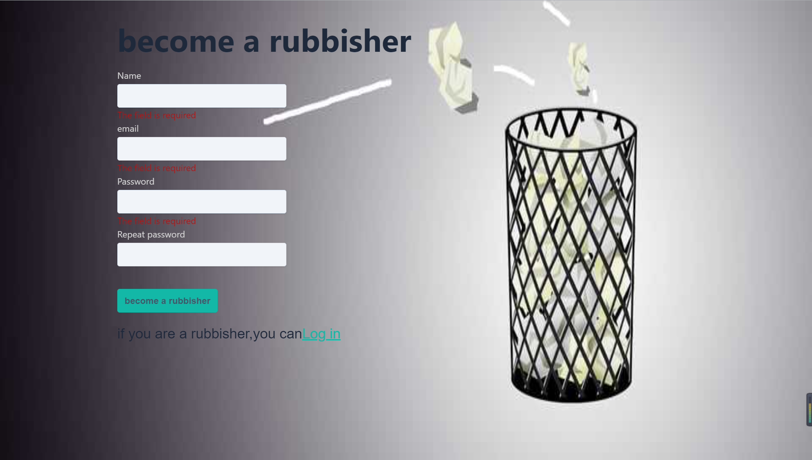
  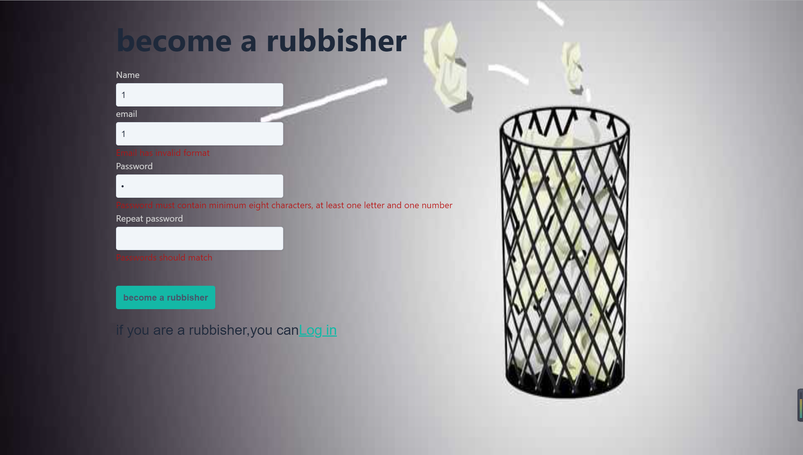
  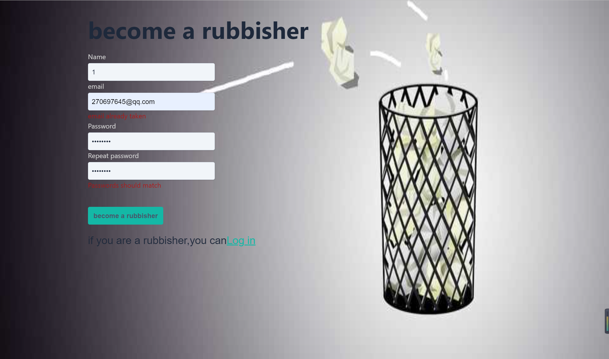
  - 注册成功页面
  
  - 登录页面
  
  - 无效登录页面
  
  - 登录成功，上传文件页面(修改后的不可注入漏洞页面)
  
  - 成功上传页面
  
  - 继续上传文件页面
  
  - 查看已上传文件页面
  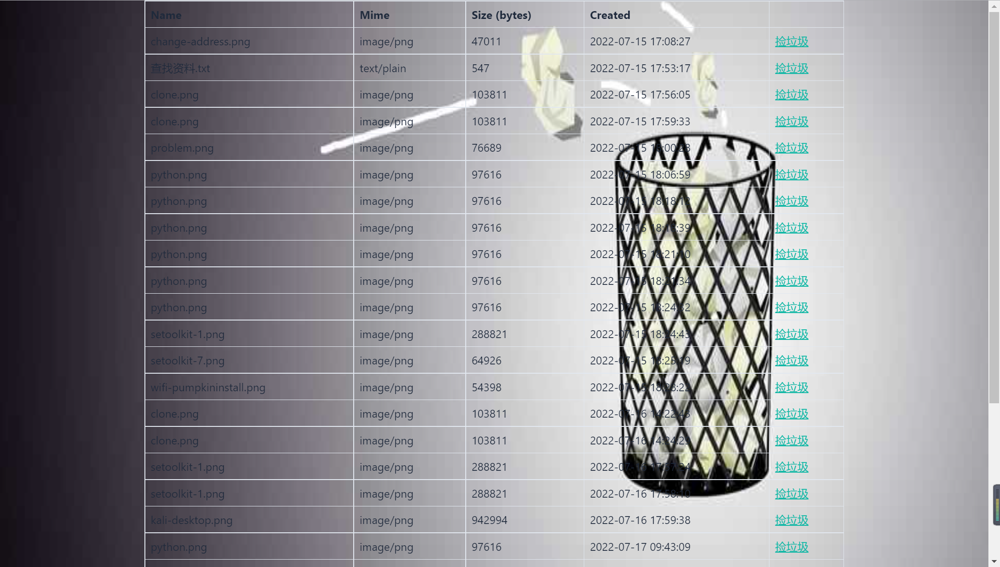
  - 退出登录页面
  
- 可进行sql注入的登录页面
  - 此页面为最初确定的可进行sql注入的登录页面
  - 用户使用姓名登录，相对于用邮箱登录安全性降低，且密码取消了哈希值，更便于进行sql注入
  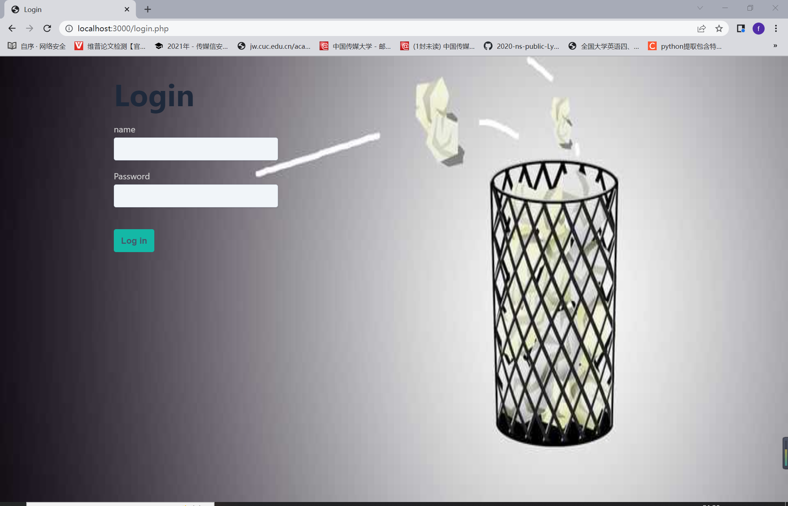
  - user 数据库需对应增加一个无 hash 值的密码字段
  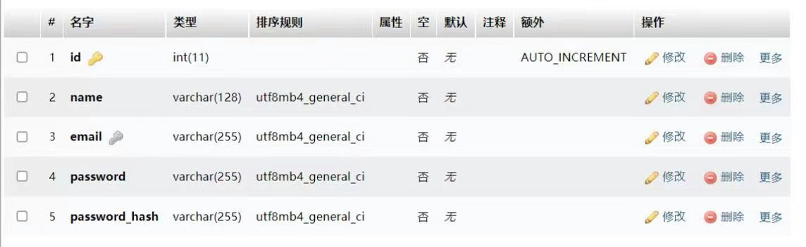
- 可注入漏洞文件上传页面
  - 此页面为最初确定的可注入文件上传漏洞的页面
  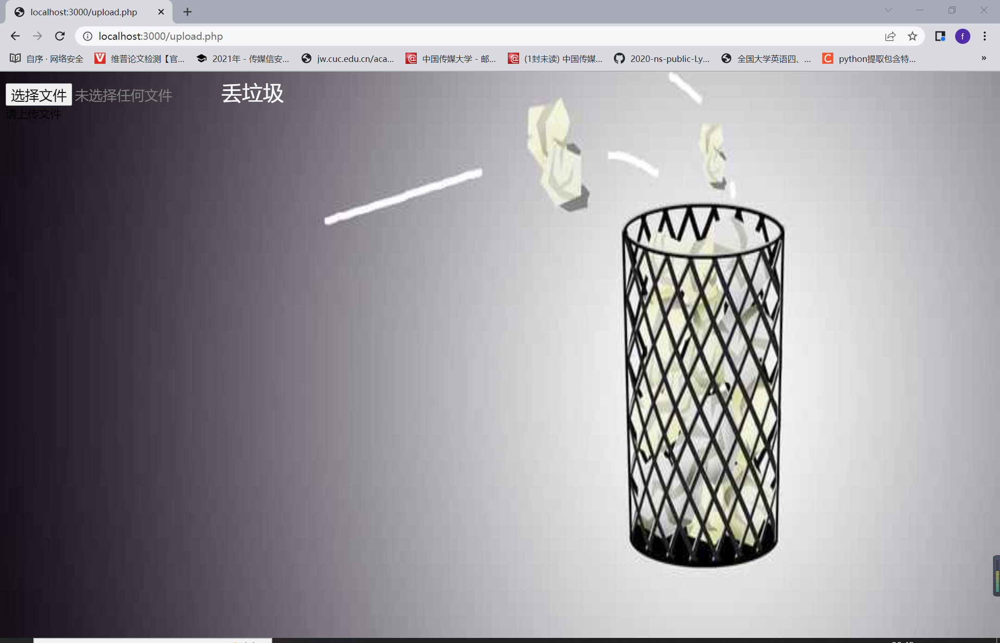
  - 上传成功可显示文件保存的路径(/uploadFiles/)和文件名，便于进行文件上传漏洞的实验
  

## 实验过程中的问题
### 安装 php 环境
- 参照链接安装完 xmapp 配置环境变量，打开cmd命令行输入 `php-v` 时会报错，通过查看 [安装php报错](https://blog.csdn.net/qq_37993490/article/details/119315043) ,下载插件并安装，但还是报错，最后将第一次下载的 xampp 进行卸载，重新安装配置之后就成功了
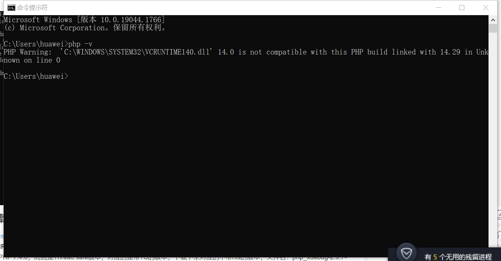
- 配置 VSCode 中的 php 插件，修改 setting.json 时，链接中只提到了添加一行，但是会报错，参考其他链接可知需要添加以下两行代码，即可完成正常配置（根据自己的安装路径填写）
```
    "php.debug.executablePath": "D:/xampp/php/php.exe",
    "php.validate.executablePath": "D:/xampp/php/php.exe",
```
### phpMyAdmin 安装
- 安装 phpMyAdmin 需要参照 [phpMyAdmin安装详情](https://blog.csdn.net/weixin_49079403/article/details/119669106) ，一开始参照网上的教程进行修改，添加配置文件导致 MySQL 服务无法正常开启，经反复修改，形成上文实验步骤中的配置方法
- 在配置第二个数据库时，无法正常使用，通过对比第一个login_db数据库的索引id发现是缺少了额外属性中的“AUTO_INCREMENT”，需要在页面上点击 AI 方框中的对号即可
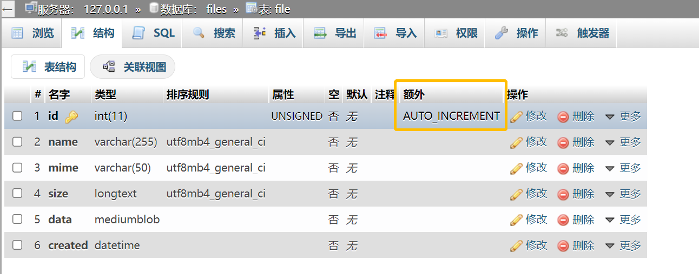
## 参考链接
- [如何在VSCode配置PHP开发环境](https://blog.csdn.net/qq_44803335/article/details/108806851)
- [三种将CSS添加到HTML中的方式](https://blog.csdn.net/qq_63389054/article/details/124504908)
- [安装php报错 PHP Warning](https://blog.csdn.net/qq_37993490/article/details/119315043)
- [VSCode配置PHP开发环境和插件PHP server，PHP Debug调试的配置使用](https://blog.csdn.net/qq_44695727/article/details/125023932)
- [phpMyAdmin安装详解](https://blog.csdn.net/weixin_49079403/article/details/119669106)
- [phpMyAdmin安装配置教程](https://blog.csdn.net/God_68/article/details/123859045)
- [phpmyadmin 下载、安装、配置](https://blog.csdn.net/qq_38705449/article/details/103525497)
- [无类CSS框架cupcake](https://github.com/halfmage/cupcake.css/)
- [JustValidate - modern form validation library written in Typescript](https://just-validate.dev/)
## 备注
* 本部分由两人共同完成
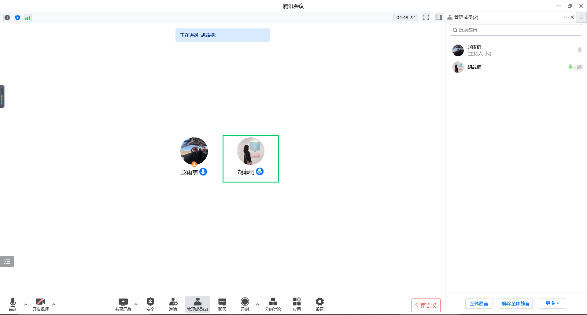