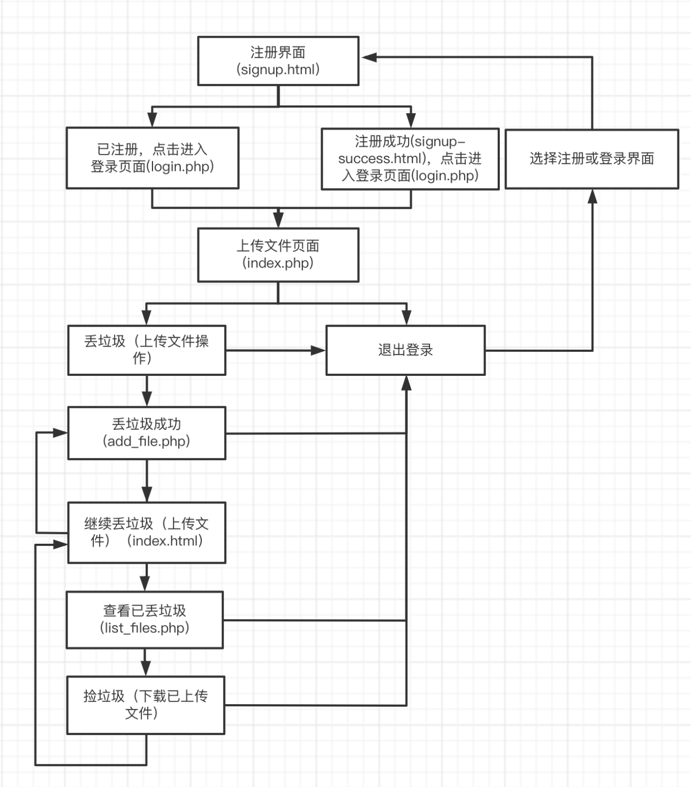

赵雨萌
# 《320垃圾回收站》综合实践
## 前端与后端开发部分实践（此部分由两人共同完成）
### 实践目的及内容
- 本次实践设计网站可实现注册、登录通过`MySQL`数据库验证以及文件的上传和下载功能，通过`MySQL`数据库保存数据。
- 仿真目标类似网盘
- 各功能页面可明确通过链接方式跳转
- 用户操作出错提供错误提示信息
### 实践环境及工具
- php
- xampp
- apache
- MySQL
- phpmyadmin
### 实践过程介绍
#### 基础网站构建
1. 注册前端（即`become a rubbisher`）`signup.html`
    - 用户账户与`Email`唯一对应，避免重复注册
    - 密码输入不可见，且包含确认密码再次输入保证用户没有错误输入
    - 添加`css`样式(无类样式表)，界面美观
2. `php`环境搭建
    - 下载并安装`xampp`（已有因此直接使用）
    
    - 将`xampp`文件夹中`PHP.exe`所在文件夹路径添加进环境变量-系统变量-`Path`
    - 在`cmd`中输入`php -v`，检查是否配置成功
    
    - 下载并安装`vscode`（已有直接使用）
    - 安装相关扩展      
    
    - 在`VSCode`的文件-首选项-设置中`setting-json`添加配置
    
    - 修改`phpserver`插件配置，详见问题解决1
3. 注册错误提示 `process-signup.php`
    - 验证输入：名称不能为空；使用电子邮件验证函数验证电子邮件格式是否合规；密码至少为8位并至少包含一个字母，使用正则表达式匹配;确认密码部分与其上密码部分保持相同
    - 错误提示（未添加`JavaScript`）
    
    - 将密码存储为`hash`
#### 后端数据库连接
4. `phpMyAdmin`配置
    - 下载`phpmyadmin`并解压至`xampp`文件夹中
    - 将`config.sample.inc.php`，改名为`config.inc.php`
    
    - 修改其上文件
    
    - 将`xampp`中的`apache`和`MySQL`连接即可打开`phpmyadmin`
5. 连接数据库`login_db`，与注册及登录界面相连
    - 创建`user`表，包含4列。4列分别为：`id（primary key），name，Email（unique），password_hash`
    - 使用`database.php`将数据库与页面连接
        - 如果发生连接错误则报错，`sql`出错则报错，判断`Email`是否重复注册
    - 数据库结构
    
    - 注册结果示例
    
6. 登陆成功后跳转到`signup-success.html`界面
7. 登陆界面`login.php`
    - 最初设计登录界面为使用用户名和密码登录，密码未采用`hash`，安全性不高，因此之后漏洞注入在此基础上注入(下图为数据库结果)
    - 
    - 以下为完善后的登录
    - 将其与数据库进行连接，在数据库中匹配已注册`Email`，验证数据库密码`hash`和输入密码`hash`是否匹配
    - 若登录无效则显示提示信息
8. 使用`PHP`将文件上传到`MySQL`数据库
    - 最初文件上传未使用数据库，而是直接上传到本地，该方法易于嵌入漏洞，且无法完成下载功能
    - 以下为完善后的文件上传
    - 连接数据库`files`，与文件上传界面相连
    - 创建`file`表，包含6列。6列分别为：`id（primary key），name，mime，size，data，created`
    - `index.php`可实现文件（初次）上传
    - `add_file.php`将文件添加到数据库，并判断是否上传成功，上传失败与成功均有提示，成功后可继续上传
    - 数据库结构
    
    - 上传结果示例
    
9. `list_files.php`查看已上传文件，列出现有文件，且可下载
    `get-file.php`错误提示
10. `index.php`
    - 若登录成功到达该节目该界面显示个性化信息，能够反映登陆者`name`，并可上传文件
    - 成功上传初次文件后可再次来到`index`界面继续上传并查看以传文件
    - 若退出登录则到该界面可选择注册或登录
11. `logout.php`选择退出即可返回`index`界面选择注册或登录
12. 用户友好，添加`JavaScript`
    - `validation.js`添加验证字段,使用户更清楚哪里输入不合规
    - `validate-email.php`，连接数据库，查看给定Email是否已经存在记录
#### 前端最终优化
13. 前端美化部分
    - 字体，字体大小，字体颜色，`input`输入框背景色设置，网页背景设置
### 实践结果展示
- 流程图

- 注册界面

- 注册错误提示（`JavaScript`）

- 注册成功界面

- 优化之前的登陆界面

- 登录界面

- 优化前文件上传界面及上传成功界面

- 登陆成功初次上传文件界面

- 上传成功，再次上传`index`界面

- 再次上传，查看已上传界面

- 退出登陆后的`index`界面

### 实践问题解决
1. 配置`php`环境时，无法弹出网页(`php not found`)
    - 解决：将插件`php server`的配置`browser`填写浏览器路径；`php path`填写`php`运行文件；`phpserver ip`填写`localhost`
    
2. `vscode git bash终端配置："message": "此项已弃用，配置默认 shell 的新推荐方法是在 #terminal.integrated.profiles.windows#`
    - 解决：将原有配置（图中注释部分）改为图中配置即可
    
3. 配置`phpmyadmin`时，在`xampp`中`MySQL`无法连接
    - 
    - 解决：发现端口号3306被占用，因此将`apache`和`MySQL`的端口号统一改为3316即可
4. 建立第二个数据库一定要记得id属性为`unsigned`且额外`auto_increment`
### 实践参考资料
- [cupcake.css](https://cupcake-css.netlify.app/) 
- [(21条消息) 如何在VSCode配置PHP开发环境（详细版）_徐一一的博客-CSDN博客_vscode配置php开发环境]( https://blog.csdn.net/qq_44803335/article/details/108806851)
- [(21条消息) VSCode配置PHP开发环境和插件PHP server，PHP Debug调试的配置使用，全_瑶山的博客-CSDN博客_phpserver插件 ](https://blog.csdn.net/qq_44695727/article/details/125023932)
- [vscode git bash终端配置：“”message": "此项已弃用，配置默认 shell 的新推荐方法是在 `#terminal.integrated.profiles.windows# - Tsunami黄嵩粟 - 博客园 ](https://www.cnblogs.com/ht955/p/15005730.html)
- [(21条消息) phpMyAdmin安装配置教程_God_6838的博客-CSDN博客_phpmyadmin配置 ](https://blog.csdn.net/God_68/article/details/123859045?ops_request_misc=%257B%2522request%255Fid%2522%253A%2522165786337616782395320121%2522%252C%2522scm%2522%253A%252220140713.130102334..%2522%257D&request_id=165786337616782395320121&biz_id=0&utm_medium=distribute.pc_search_result.none-task-blog-2~all~top_click~default-1-123859045-null-null.142)
- [JustValidate - modern form validation library written in Typescript ](https://just-validate.dev/)
- [XAMPP无法启动mysql](https://blog.csdn.net/segegefe/article/details/124465115)
### 备注
- 本部分由两人共同完成
